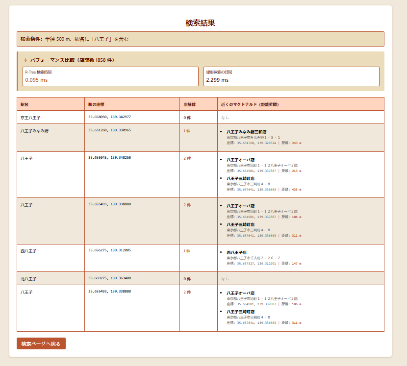

# 駅周辺マクドナルド検索システム

R-Tree空間インデックスを使用した高速な店舗検索システムです。

## 機能

- 駅名を入力して周辺のマクドナルド店舗を検索
- 検索半径を指定可能（50-10000メートル）
- R-Treeと線形探索のパフォーマンス比較

## インストール

```bash
pip install -r requirements.txt
```

## 使用方法

```bash
python app.py
```

ブラウザで `http://127.0.0.1:5000` にアクセスしてください。

## 画面

### 検索ページ


### 結果ページ



## データファイル

- `N02-24_Station.geojson`: 駅データ
- `Mc_six_fields_from_mc.json`: マクドナルド店舗データ

## 技術スタック

- Flask: Webフレームワーク
- R-Tree: 空間インデックス

